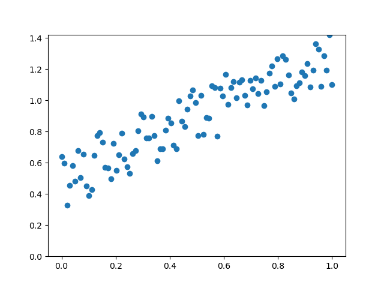

# Gradijentni spust

Algoritam gradijentni spust je algoritam kojim se se optimizira pronalazak parametara određene funkcije odnosno modela koji približno opisuje podatke.

Algoritam se temelji na deriviranju izračuna razlike kvadrata u kojoj je ugnježđena željena funkcija koja se fita.

Recimo da imamo skup podataka koji linearno koreliraju (primjer linearne regresije):

Pomoću algoritma gradijentnog spusta moguće je pronaći parametre pravca ($a$ i $b$, nagib i presjek osi $y$) ali i mnogih drugih funkcija.

> linearna regresija se obično riješava metodom najmanjih kvadrata

(1) Funkcija pravca

$$ y = a*x+b $$

